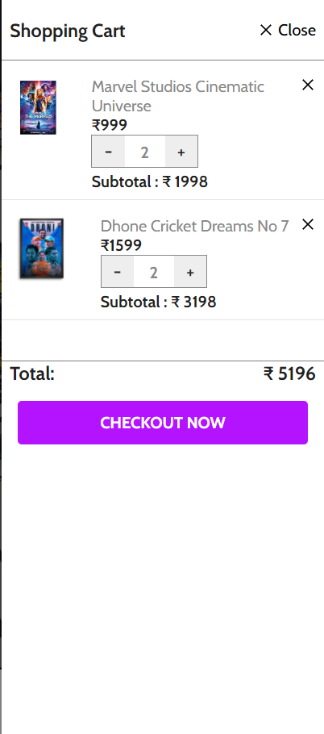

## Home Page

The **Home Page** of Posterz. serves as the central hub for all our categories and featured products. It provides an easy-to-navigate interface where users can explore various collections, including TV Shows, Sports, and Anime posters. The design is clean and modern, focusing on highlighting the vibrant and detailed artwork that we offer.

### Key Sections of the Home Page:

- **Shop By Categories:** Allows users to quickly access posters based on their interests, whether it be TV Shows, Sports, or Anime.
- **Our Top Picks:** Features a curated selection of popular posters, providing quick access to the most sought-after designs.
- **Exclusive Print and Artwork:** Showcases the exclusive collection of artwork available on Posterz., offering unique designs for art enthusiasts.

Below is a screenshot of the Home Page:

### Categories

Users can explore different categories of posters through the dedicated sections on the Home Page. Each category provides a tailored selection of posters, ensuring that users can easily find designs that match their interests.

#### Anime Category

The **Anime** category showcases a wide range of posters featuring popular anime characters and scenes. From iconic moments in anime history to stylized artistic representations, this section is perfect for anime fans.

- **Featured Posters:**
  - _One Piece Monkey D. Luffy Anime_: ₹459
  - _Dragon Ball Z Goku Art_: ₹999

#### Sports Category

The **Sports** category offers a variety of posters featuring famous athletes, teams, and iconic sports moments. Whether you're a cricket fan or follow football, this section has something for every sports enthusiast.

- **Featured Posters:**
  - _Dhoni Cricket Dreams No 7_: ₹1599
  - _Virat Kohli Success Quote_: ₹599

#### TV Shows Category

The **TV Shows** category includes posters from popular TV shows across various genres. Whether you're into drama, sci-fi, or fantasy, you can find posters that reflect your favorite TV moments.

- **Featured Posters:**
  - _Game Of Thrones Quotes_: ₹399
  - _Tallenge - Oppenheimer_: ₹399
  - _Ant-Man and The Wasp: Quantumania_: ₹699

### Add to Cart Page

The **Add to Cart** page is a crucial component of the shopping experience on Posterz. This page allows users to review the items they have selected for purchase, modify quantities, remove items, and proceed to checkout.

#### Key Features of the Add to Cart Page:

- **Product Overview:** Displays a list of all items the user has added to their cart, including product images, titles, prices, and quantities. This gives users a clear view of what they are purchasing.

- **Quantity Adjustment:** Users can easily adjust the quantity of each item directly from the cart page. This is useful for users who may decide to purchase more or fewer units of a particular poster.

- **Remove Items:** Provides the option to remove individual items from the cart. This feature allows users to manage their selections before finalizing the purchase.

- **Subtotal Calculation:** The page dynamically updates the subtotal based on the items and their quantities in the cart. This gives users an immediate view of the total cost before taxes and shipping.

- **Proceed to Checkout Button:** A prominent button on the page that allows users to proceed to the checkout process where they can finalize their order. The button is typically placed at the bottom or top of the cart for easy access.

Below is a screenshot of the Add to Cart Page:

### User Flow:

1. **Adding Items:** Users add posters to their cart from the product pages. Each time an item is added, it appears on the Add to Cart page with default quantity set to 1.

2. **Reviewing the Cart:** On the Add to Cart page, users can review all selected items. They can see the poster image, title, price, and the selected quantity.

3. **Making Adjustments:** Users can adjust the quantity or remove items as needed. The subtotal automatically updates based on these changes.

4. **Proceeding to Checkout:** Once satisfied with their selections, users can click on the "Proceed to Checkout" button to enter their shipping information and payment details.

This page is designed with simplicity and clarity in mind, ensuring that users can easily manage their purchases without any confusion or hassle.

### Checkout Page

The **Checkout Page** is the final step in the purchasing process on Posterz., where users provide necessary details to complete their purchase. This page is designed to be straightforward and secure, ensuring that users can finalize their orders with ease and confidence.

#### Key Features of the Checkout Page:

- **Shipping Information:** Users are required to enter their shipping details, including name, address, city, state, postal code, and country. This information is critical for ensuring that the posters are delivered to the correct location.

- **Payment Information:** The page includes a secure form for users to enter their payment details. Accepted payment methods typically include credit/debit cards, PayPal, and other local payment gateways. The form is designed to be user-friendly while adhering to security standards such as SSL encryption.

- **Order Summary:** A concise summary of the order is displayed on the checkout page. This summary includes the items in the cart, their quantities, prices, and the total cost, including taxes and shipping fees. Users can review this summary to ensure everything is correct before proceeding.

- **Apply Discount/Promo Code:** Users have the option to enter a discount or promo code if they have one. The page will automatically recalculate the total cost after the code is applied, providing an updated order total.

- **Billing Address:** In addition to the shipping address, users can enter a billing address if it differs from the shipping address. This ensures accurate processing of payment.

- **Place Order Button:** Once all necessary information is entered, users can click the "Place Order" button to finalize their purchase. This button is usually prominent and positioned at the bottom of the page for easy access.

- **Order Confirmation:** After placing the order, users are typically redirected to an order confirmation page, which includes an order number and a summary of the purchase. They may also receive an email confirmation with the same details.

Below is a screenshot of the Checkout Page:

### User Flow:

1. **Navigating to Checkout:** After reviewing their cart, users click the "Proceed to Checkout" button, which takes them to the Checkout page.

2. **Entering Shipping Details:** Users provide their shipping information, ensuring that all fields are correctly filled out for accurate delivery.

3. **Providing Payment Information:** Users enter their payment details securely. The page is designed to guide users through this process, minimizing any confusion or errors.

4. **Reviewing the Order:** Before placing the order, users can review the order summary, apply any discount codes, and double-check their shipping and billing information.

5. **Placing the Order:** Once everything is verified, users click the "Place Order" button to complete their purchase. The system then processes the payment and confirms the order.

This page is crucial as it combines both security and usability, ensuring that users can complete their transactions smoothly and without any concerns.
